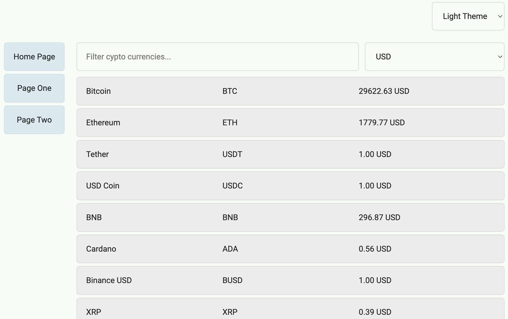

# CryptoCurr Assignment
## Installation (NPM)

### Frontend Installation
- Install Nodejs (if not already installed on your system)
- Download/clone the project
- Open terminal and cd into project dir (e.g. "cd path/to/project/cryptos")
- Install packages with the "npm install" command
- Start the project with the "npm start" command
- Type "http://localhost:3000" into your web browser's address bar
- Now you should start backend installation by following the commands in the following section

### Backend Installation
- cd into backend dir (e.g. "cd path/to/project/cryptos/backend")
- Install packages with the "npm install" command
- Start the backend with the "npm start" command
- Application is ready to use now

## Installation (Docker)
- Install Docker Desktop (if not already installed)
- cd into cryptos/backend dir
- Run "docker build --tag node-rest-api ." command
- Run "docker run -p 8000:8000 node-rest-api" command
- cd into cryptos dir (e.d "cd ..")
- Run "docker build --tag crypto-frontend ." command
- Run "docker run -d -p 3000:3000 crypto-frontend" command
- Type "http://localhost:3000" into your web browser's address bar to see the working app

## Stopping Docker Containers & Deleting Images
- Run the "docker ps" command
- You will see something similar to:

some_container_id_1&emsp;crypto-frontend&emsp;...

some_container_id_2&emsp;node-rest-api&emsp;...

- Run "docker kill fd3 some_container_id_1 some_container_id_2" to stop the containers
- Run "docker images" to list images on your system
- You will see something similar to:

REPOSITORY&emsp;TAG&emsp;IMAGE ID       

crypto-frontend&emsp;latest&emsp;some_image_id_1&emsp;...

node-rest-api&emsp;latest&emsp;some_image_id_2   ...

- Run "docker  rmi -f some_image_id_1 some_image_id_2" to remove the images

## About the App
This application has the following features/functionalities complying with the assignment requirements doc:

- It is responsive (try resizing the browser's width to see UI changes). Responsiveness is implemented by using CSS grids and media queries. No additional CSS framework was used in this project except the hamburger icon and its animation (see src/sass/vendors/hamburger.scss by Jonathan Suh). 
- The home screen is shown in desktop view:

- Here are the mobile views of the home page:

- It has light and dark modes

- Home page has dynamic filtering capabilities. Just type your filter query into the text box having "Filter crypto currencies..." placeholder. Both name filters like "Bitcoin" and symbol filters "BTC" will work.
- To prevent excessive filtering, which might be a costly operation on large datasets, debouncing is implemented. That is, a timer suspends the filtering operation until an interval of at least 250ms occurs since the last client keypress event.
- Exchange rates can be changed from the dropdown located in the top-right side of the UI. The default rate is USD.
- There are 2 additional links in the sidebar navigating to 2 empty pages (Page One, Page Two).
- List component limits fetching at most 40 assets from the API at a time. This is implemented by using the "react-infinite-scroll-component". When the user scrolls to the bottom of the page a batch of 40 assets are fetched from the API. This behavior can be easily observed by activating the "network throttling" functionality of the browser's developer tools.
- Clicking on any asset on the homepage will redirect to the asset's details page.

- Details page connects to an express server to get asset details such as rank, supply, market cap, etc. Even though this step is not necessary, it is implemented this way to demonstrate basic express.js usage. The frontend app sends a GET request to the express server with the id parameter of the asset to be shown; the express server sends a GET request to CoinCap API with the same asset id and forwards the result to the frontend.

- Overall, all requirements, hints, and bonus points given in the assignment doc are implemented. 
- Cheers! :pray:
